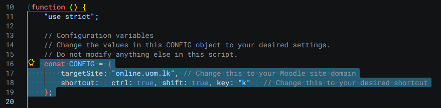

# Moodle Course Quick Open

## Description
This repository contains a Tampermonkey script designed to quickly open Moodle courses. It simplifies the process of navigating to specific courses within Moodle by providing a streamlined search overlay.

## Features
- Quick access to Moodle courses.
- Configurable target site and keyboard shortcut.
- Easy to use and customize.

## Prerequisites
- Tampermonkey or a similar browser extension installed.
- A Moodle account with access to courses.

## Installation
1. Install the Tampermonkey extension for your browser.
2. Create a new script in Tampermonkey and paste the contents of `script.js`.
3. Save the script.

## Configuration
The script includes a `CONFIG` object at the top of the file (line 16) where you can:
- Change the `targetSite` to your Moodle site domain (e.g., `online.uom.lk`).
- Modify the `shortcut` to your desired keyboard combination (e.g., `Ctrl+Shift+K`).
```js
 const CONFIG = {
        targetSite: "online.uom.lk", // Change this to your Moodle site domain
        shortcut: { ctrl: true, shift: true, key: "k" } // Change this to your desired shortcut
    };
```



## Usage
1. Navigate to your Moodle site (e.g., `https://online.uom.lk`).
2. Use the configured keyboard shortcut to open the course search overlay.
3. Type keywords to filter courses and press Enter to navigate.

## Contributing
Contributions are welcome! Please fork this repository and submit a pull request with your changes.

## License
This project is licensed under the MIT License. See the LICENSE file for details.

## Author
[Malindu Bandara](https://github.com/thisismalindu)